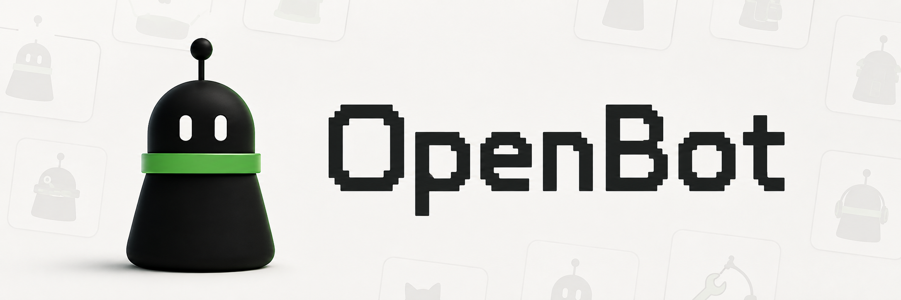

<p align="center">
  
</p>

# OpenBot

**マルチチャネル・マルチエージェントのデジタルワーカー向けセルフホスト型ワークスペース。**

[English](README.md) · [简体中文](README.zh-CN.md) · [日本語](README.ja.md) · [Português (Brasil)](README.pt-BR.md)

[](https://github.com/yxflc11/openbot/actions/workflows/ci.yml)
[](LICENSE)
[](package.json)
[](#プロジェクトの状態)

OpenBot は、自分で管理するコンピューター上で、名前を持つ AI 従業員を動かすための、初期段階の
オープンソースかつセルフホスト型のプラットフォームです。OpenBot 自体も、マルチチャネル・
マルチエージェントのタスク処理に特化したエージェントです。OpenBot Server が、アイデンティティ、
ルーティング、ポリシー、承認、永続化、監査に対する権限を保ったまま、範囲を限定した作業を
外部エージェントへ委任できます。

目標とする製品には、2 つの完全なクライアントがあります。OpenBot Desktop は推奨される
ガイド付きの導入経路です。各コンピューターに同じアプリケーションをインストールし、Client、
Server、Worker の各ロールを任意に組み合わせて有効にします。OpenBot Web は同じワークスペースへ
接続します。また、Server、Web、PostgreSQL、Worker の各サービスを個別に配備する上級ユーザー
向けの主要クライアントとしても利用できます。

Mac mini は実用的な Worker Host の一例にすぎず、製品の境界ではありません。Windows、macOS、
Linux のコンピューターはいずれも、日常利用する端末であると同時に、許可された作業端末にも
なれます。OpenBot は、Grok Bot などの常時稼働するチャネル中心の体験や、DeepSeek Harness の
ブラウザー管理型エージェント体験に着想を得つつ、セルフホスト、プロバイダー中立、拡張可能性、
そして明示的な人間の制御を重視して設計されています。

> [!WARNING]
> OpenBot は pre-alpha 段階のソースコードであり、以下で説明する完成済みの Desktop 製品では
> ありません。現在のコンピュータープロバイダーは読み取り専用で、入力、クリック、送信、
> 本番アカウントの操作は**行いません**。支払い方法、主要アカウント、本番認証情報を接続しないで
> ください。デプロイを外部公開する前に、[セキュリティ](#セキュリティ)をお読みください。

## OpenBot を作る理由

- **使い捨てのチャット画面ではなく、ローカルのチャネル。** Bot、会話、Run、結果は、自分の
  PostgreSQL データベースに永続化されます。
- **交換可能でクロスプラットフォームなコンピューター。** 従業員は永続的なアイデンティティと
  ポリシーを持ちます。Worker Host は Windows、macOS、Linux、VM、コンテナー、管理対象端末の
  いずれでもよく、交換できます。
- **成長し、移動できる従業員。** 各従業員は、根拠に基づく進化履歴、スキルグラフ、意思決定の
  追跡、メモリ、作業記録、設定、安全な移植性の制御を持ちます。
- **副作用の前に承認。** 機密性の高い操作は、明示的で監査可能な承認状態に入ります。モデルが
  自ら追加の権限を付与することはできません。
- **Desktop と Web を通じた 1 つのワークスペース。** 両クライアントは、Server が管理する
  同じチャネル、エージェント、タスク、承認、端末、プラグイン、履歴を使用します。
- **各コンピューターで組み合わせ可能なロール。** 同じ Desktop インストールを Client として
  使うことも、Server をホストすることも、Worker サービスを実行することも、それらを組み合わせる
  こともできます。
- **ネイティブ OpenBot と外部エージェント。** OpenBot は調整役のエージェントであり続け、
  Hermes、Pi、OpenClaw、および将来のアダプターへ範囲を限定した作業を委任できます。
- **自己認可を許さないオープンな拡張。** プラグインは表示を変更し、ツール、チャネル、
  エージェント、自動化を追加できますが、権限を付与できるのは Server だけです。
- **組み合わせ可能な Bot アイデンティティ。** Bot の外観は、頭部、胴体、移動方式、
  アクセサリー、アクセントカラーという 5 つの独立したレイヤーとして保存されます。
- **ロックインではなくアダプター。** モデル、コンピューターランタイム、上流プロジェクトは、
  型付けされ、バージョン管理された境界を通じて接続します。

従業員の進化と学習の方向性は、明確に
[Hermes Agent の learning graph](https://github.com/NousResearch/hermes-agent/blob/63279301bcbdc185c1b07b98a9312eb0c862f26d/agent/learning_graph.py)
から着想を得ています。OpenBot は、Server が管理する独自の根拠、レビュー、権限、移植性モデルを
維持しており、learning graph の概念を OpenBot の発明として提示しません。

## 目標とする製品モデル

> [!NOTE]
> この節は、合意済みの製品方針を定義します。Desktop、ガイド付きサービスインストール、
> 外部エージェントアダプター、プラグインプラットフォームが現在利用可能だと主張するものでは
> ありません。

| 導入経路 | 想定する体験 |
| --- | --- |
| OpenBot Desktop | macOS、Windows、Linux 向けに推奨される完全なクライアント。ワークスペースの作成、接続、サービスのインストール、権限、診断、復旧を案内します。 |
| OpenBot Web | 同じワークスペースへリモートアクセスするための完全なブラウザークライアント。モジュール型セルフホスト構成の主要クライアントとしても利用できます。 |
| モジュール型セルフホスティング | Desktop を必要とせず、Server、Web、PostgreSQL、1 つ以上の Worker サービスを個別にインストールする上級者向けの経路です。 |

Desktop のロールは別エディションではなく、組み合わせ可能な機能です。

| ロール | 責務 |
| --- | --- |
| Client | チャネル、メッセージ、タスク、承認、設定、監視。 |
| Server | ワークスペースの正本、アイデンティティ、ルーティング、ポリシー、承認、永続化、監査。 |
| Worker | 明示的に許可された Provider を通じ、現在のコンピューター上でバックグラウンド実行。 |

1 台のコンピューターで 3 つすべてのロールを有効にできます。「5 台のコンピューター」という
選択肢はオンボーディングの進捗であり、ライセンスや権限の上限ではありません。各コンピューターは
個別に登録され、個別に取り消せます。

OpenBot における最初の外部エージェント統合方式は、範囲を限定した委任です。外部エージェントが
チャネルへ直接参加する機能は、アイデンティティ、メモリ、ライフサイクル、権限の挙動がネイティブ
OpenBot エージェントと同じ適合性テストに合格した後に追加されます。

プラグインモデルは、UI／テーマ、チャネル、エージェントアダプター、ツール／プロバイダー、
自動化、任意の体験をサポートする予定です。プラグインは、付与されたケイパビリティの範囲内で
機能の見た目や動作を決められますが、自分が持つ権限を決めることはできません。

## プロジェクトの状態

OpenBot は現在、ローカルチャネルからリモート実行 Node へ、そして結果が戻るまでのテスト済みの
垂直スライスを提供します。次の表は、動作するコードと計画中の機能を意図的に区別しています。

| 領域 | 現在利用可能 | 次のステップ |
| --- | --- | --- |
| コントロールプレーン | ローカル Owner 認証、ドリフト検査付き PostgreSQL マイグレーション、Bot、チャネル、メンバーシップ、メッセージ、Run、承認、成果物、従業員メモリのライフサイクル、内容を含まない複数端末プロファイル無効化通知、監査イベント | Desktop ブートストラップ、永続的なルーチン、メモリの検索／保持、自動復旧ツール、マルチユーザー信頼 |
| クライアント | レスポンシブでチャネル中心の Web UI、名前付き Bot の指定、Bot 名義の結果、返信、リッチテキスト／表、Run Inspector、承認、Node 管理、スナップショット復旧付きの有界 SSE、アクセシブルな従業員タブ、ネイティブなモーダルフォーカス処理 | React UI を共有するサンドボックス化された Electron Desktop、ロール設定ガイド、インストール可能な Web／PWA、通知、ローカライズの改善 |
| Bot アイデンティティ | 各 Bot とともに永続化され、チャネルと従業員プロファイルで再利用される 5 レイヤー構成の外観 | パーツの追加とコミュニティ製の外観パック |
| 従業員プロファイル | 7 ビューのプロファイル、リビジョン検査付きの Owner による役割・経歴編集、Hermes に着想を得た日付付き進化アーカイブ（フィルターと完全な根拠参照を含む）、検査可能な Owner のスキルレビュー、内容を含まない監査付きの Owner 管理型メモリ、経歴を保持しレビュー済みダウンロードと正確に結び付いた安全なテンプレートエクスポート、隔離されたインポート、レビュー後の新規アイデンティティ有効化、実験的な DSSE 署名 | 表示名／モデル／ホスト／外観のポリシー編集、メモリの検索／保持と自律提案、ネイティブキーリング／KMS と公開信頼アダプター、完全な差分レビューを伴う実行可能 Agent Skills バンドル、選択的複製、レジストリ配布、所有権移転 |
| Node プロトコル | 外向き WebSocket 登録、Owner UI による 1 回限りのペアリング／一覧／取り消し、個別に取り消せる認証情報、ハートビート、容量、ケイパビリティのメジャーバージョンを正確に合わせたルーティング、2 段階割り当て、明示的な開始、進捗、フレーム、完了、切断からの復旧、契約テスト済み Secret Service を備えた実験的 Linux システム／ユーザーサービスプロファイル | Worker ロールのガイド付きインストール、所持証明アイデンティティ、mTLS、ローテーション、リプレイ防止、ネイティブキーリング、署名済みインストーラー、実機適合性レポート |
| ブラウザー実行 | 固定された CopilotKit/OpenBot `agent-computer` 境界を通じて、明示された公開 HTTP(S) URL を開き、サイズを制限した PNG スクリーンショットを返す | observe／fill／act ループ、連続フレーム、安全なフォーム操作、リトライセマンティクス |
| 人間による制御 | Run、Node、操作、対象フィンガープリント、リスク、有効期限に結び付いた永続的な承認要求／決定フロー | 1 回限りの署名付き capability lease と排他的なリモートテイクオーバー |
| Provider | 動作する読み取り専用 Docker／ブラウザーアダプター。型付けされた Cua、Lume、coder パッケージ境界 | 移植可能なブラウザーに加え、Windows、macOS、Linux デスクトップ、管理対象 Android、隔離されたコーディング Provider |
| エージェントランタイム | Server が管理する Bot、チャネル、Run、結果、プロファイル、スキル、メモリ、監査の基盤 | ネイティブ OpenBot エージェント、永続的なマルチエージェント引き継ぎ、範囲を限定した Hermes、Pi、OpenClaw アダプター |
| プラグイン | コアアプリに依存しない、隔離された `@openbot/office-plugin` パッケージ | 権限制御されたマニフェスト、ライフサイクル、サンドボックス化された Host API、UI スロット、ローカル開発、将来の信頼済み配布 |
| 配布 | ソースコードと、以前のソースのみの基盤プレビュー | GitHub Releases の署名済み Desktop インストーラー、Worker 成果物、アップグレード／ロールバックの根拠、独立して利用できる SDK またはコンテナーパッケージ |

### 現在のリリースが主張しないこと

- 現在、公開済みの OpenBot Desktop クライアント、ガイド付きマルチロールインストーラー、
  インストール可能な Worker Host、GitHub Packages 上の OpenBot 成果物はありません。以前の
  `v0.1.0-alpha.1` リリースはソースのみの基盤プレビューであり、現在のリポジトリや
  目標とする Desktop 製品を表すものではありません。
- 無人でのフォーム送信や、任意のデスクトップ操作は行いません。
- 承認後に、暗号化された 1 回限りの capability lease を発行する機能はまだありません。
- 連続的なリモートデスクトップ操作は提供していません。
- Node の登録は個別に取り消せますが、現在のアイデンティティはコピー可能な bearer secret の
  ままです。Linux の専用ログインでは、ファイルへのフォールバックなしで Secret Service に
  保存することを明示的に選択できますが、実際のキーリング／systemd 端末での根拠は未検証です。
  所持証明アイデンティティや mTLS ではないため、WSS と信頼できるプライベートネットワークの
  内側でのみ使用してください。
- モデルは長期メモリを自律的に書き込んだり検索したりできず、保持スケジュールの適用、
  従業員経験の選択的複製、レジストリ経由の配布、所有権移転もまだ提供していません。認証済み
  Owner は、制限されたメモリを手動で追加、編集、削除できます。メモリはすべての v1 従業員
  パッケージから引き続き除外されます。
- Owner は従業員の役割と説明的な経歴を編集できます。これらはルーティングの文脈であり、
  モデルポリシー、スキル、ホストとの関連付け、権限ではありません。同時編集では古いリビジョンが
  拒否されます。
- 従業員エクスポートはデフォルトでは署名されません。運用者は、暗号化されたファイルシステム
  キーリング、オフラインのローテーション／取り消し、明示的な公開鍵信頼を用いた実験的 DSSE
  署名を有効にできます。エクスポートのダウンロードはレビューされた正確なパッケージバイト列に
  結び付けられます。インポートの有効化には引き続き、正確なプレビューダイジェスト、Owner による
  明示的レビュー、新しいローカルアイデンティティが必要で、スキルは候補のみ、メモリやホスト
  権限は含まれません。
- Cua、Lume、coder Provider は拡張境界であり、完成済みランタイムではありません。
- Hermes、Pi、OpenClaw は計画中の統合であり、現在のビルドで動作するアダプターではありません。
- プラグインのインストール、権限、サンドボックス、更新、ロールバックのライフサイクルはまだ
  ありません。
- 任意機能であるオフィス可視化は、現在の製品ナビゲーションや Web ビルドに含まれません。

## クイックスタート

これは、現在の Web／Server／Node スライスをソースから開発するための手順です。計画中の
Desktop インストールフローではありません。

### 必要条件

- Node.js 22.22.2+、24.15.0+、または 26+
- npm 10 以降
- Docker と Docker Compose

### ローカルで実行

```bash
git clone https://github.com/yxflc11/openbot.git
cd openbot
cp .env.example .env
```

`.env` を編集し、Owner パスワードのプレースホルダーを置き換えます。

```dotenv
OPENBOT_OWNER_PASSWORD=<15文字以上のランダムなパスワード>
```

Server は、直接接続したピアの IP を、仮名化されたログイン／登録のレート制限キーとしてのみ
使用します。単一ホップのリバースプロキシを使用する場合は、
`OPENBOT_TRUSTED_PROXY_ADDRESS` にそのプロキシの正確な IP を設定してください。
この場合に限り、RFC 7239 の `Forwarded: for=...` 値を 1 つ受け入れます。IP 範囲や
複数ホップのチェーンには設定しないでください。

依存関係をインストールし、PostgreSQL を起動してから、Server と Web アプリを実行します。

```bash
npm install
npm run db:up
npm run dev:server
# 別のターミナルで:
npm run dev:web
```

Web アプリへサインインし、サイドバーの **Nodes** を開いて、有効期間の短い 1 回限りの
ペアリングトークンを作成します。Server ホストの CLI でも同じ操作ができます。

```bash
npm run node:enrollment-token -- local-development-node
```

出力された `OPENBOT_NODE_ENROLLMENT_TOKEN` を `.env` へコピーし、
`npm run dev:node` を実行します。最初の起動が成功したら、トークンを `.env`
から削除してください。Node は新しい認証情報を Owner のみがアクセスできる権限で
`./data/node/identity.json` に保存し、以後の起動で再利用します。
<http://localhost:5173> を開き、`OPENBOT_OWNER_PASSWORD` でサインインし、Bot と
チャネルを作成して、そのチャネルに Bot を追加します。リモートホストをペアリングする前に、
[Node の登録](docs/NODE_ENROLLMENT.md)をお読みください。

デフォルトでは、ローカル Node は実行ケイパビリティがないことを正確に通知します。互換性のある
Provider が設定されるまで、メッセージはキュー内の Run として保存されます。PostgreSQL を
停止するには `npm run db:stop` を実行します。デプロイのアップグレード、バックアップ、
復元を行う前に、[データベース運用](docs/DATABASE.md)をお読みください。移植可能な従業員
テンプレートへ署名するには、実験的な[従業員署名ランブック](docs/EMPLOYEE_SIGNING.md)に
従ってください。署名はデフォルトで無効です。

### 読み取り専用ブラウザースライスを有効にする

Node マシンで、固定バージョンの
[CopilotKit/OpenBot `agent-computer`](https://github.com/CopilotKit/openbot/tree/257c1280d684089be9adb0b35cce262efc7064bf/agent-computer)
を実行し、loopback のみにバインドします。以下の 2 つの値に同じ computer token を設定し、
Node を再起動します。

```dotenv
OPENBOT_DOCKER_COMPUTER_URL=http://127.0.0.1:4100
OPENBOT_DOCKER_COMPUTER_TOKEN=<16文字以上のランダムなトークン>
OPENBOT_DOCKER_ALLOW_PRIVATE_HOSTS=false
```

次の例のように、明示的な公開 URL を含むメッセージをチャネルへ送信します。

```text
https://example.com を開き、スクリーンショットを送ってください。
```

Server は Run を互換性のある Node に割り当て、構造化された進捗と最新フレームをストリーミングし、
最終スクリーンショットを保存して、選択した Bot のアイデンティティで結果を投稿します。

## システム構成

```text
Desktop (計画中) --+
                    +--> OpenBot Server --> OpenBot agent / 限定されたアダプター (計画中)
Web (利用可能) ----+       唯一の正本              |
                                                    v
                                      外向き Worker 接続 --> Providers
                                      Windows / macOS / Linux
```

| コンポーネント | 管理するもの | 管理しないもの |
| --- | --- | --- |
| Desktop / Web Client | 操作、監視、設定、承認の入力 | ポリシー判断または実行権限 |
| Server | アイデンティティ、チャネル、Run、ルーティング、ポリシー、承認、監査、永続化 | ホスト固有のコンピューターケイパビリティ |
| OpenBot agent / Agent adapter | 計画、範囲を限定したタスク処理、構造化された進捗、結果 | 権限付与、端末の認可、監査の正本 |
| Worker Host / Node | ケイパビリティの検出、ローカル容量、Provider の実行、進捗、成果物 | 従業員アイデンティティ、スキル、長期メモリ、認可ポリシー |
| Provider | Docker／ブラウザー、Cua、Lume、coder など、1 つの限定された実行バックエンド | Node をまたぐルーティングまたは権限昇格 |
| Plugin | 宣言され、付与されたケイパビリティ内での表示または挙動 | 自己認可または Server ポリシーの回避 |

Server が唯一の正本です。Node は外向きに接続し、公開管理ポートを必要としません。ルーティングは
決定的です。Run に固定された execution profile とオンライン Node のケイパビリティの共通部分が
使われ、モデルは未許可のマシンを選べません。

詳細設計については、[アーキテクチャ](docs/ARCHITECTURE.md)および
[Server／Node 意思決定記録](docs/decisions/0002-local-channel-server-node.md)をお読みください。

## 開発ベースライン

OpenBot は使用言語を最小限にし、多くのコントリビューターが Node.js と npm だけで作業できる
ようにします。

| 領域 | ベースライン |
| --- | --- |
| 共有プロダクトコード | Web、Server、Node、プロトコル、Agent アダプター、プラグイン SDK、テストに TypeScript を使用 |
| ユーザーインターフェイス | Web と計画中の Electron Desktop で React と Vite を共有 |
| 本番 JavaScript ランタイム | Node.js 24 LTS を開発・デプロイの推奨ラインとする。現在のソースは引き続き `package.json` の広い engine 範囲に従う |
| 永続化 | PostgreSQL とレビュー済み SQL マイグレーション |
| macOS 専用統合 | Keychain、サービスライフサイクル、権限、ネイティブ操作のための薄い Swift レイヤー |
| Windows 専用統合 | Service ライフサイクル、保護された認証情報、プロセス監視、ネイティブ操作のための薄い C#／.NET レイヤー |
| 外部エージェント | 型付けされた OpenBot アダプターの背後で上流の言語を使用。Hermes が Python のままでも、Python が OpenBot のコア言語になるわけではない |

Electron は、現在の TypeScript／React システムを最大限再利用できるため、Desktop の方針として
採用されています。実装前に、リポジトリの調査および ADR プロセスによって正確なリリースを
固定する必要があります。将来、根拠によって裏付けられたプラットフォーム上の不足が導入を正当化
しない限り、Rust はコア言語ではありません。

## セキュリティ

OpenBot は、モデル、プロンプト、ウェブページ、スキル、実行環境を信頼できないものとして
扱います。想定されるセキュリティ境界は次のとおりです。

1. Server が認可し、Node が実行します。
2. Run は Bot、チャネル、Node、execution profile との固定された関係を持ちます。
3. 書き込み、破壊的操作、特権操作は、承認されるまで fail closed でなければなりません。
4. 成果物とリアルタイムイベントは、公開前にサイズを制限し、検証します。
5. Node は Server へ接続します。管理サービス、データベース、Docker socket、
   コンピューターバックエンドを公開してはいけません。

loopback を越えて開発環境を利用する場合は HTTPS を使用し、
`OPENBOT_SECURE_COOKIES=true` を設定し、`OPENBOT_ALLOWED_ORIGINS` を制限して、
Tailscale などのプライベートネットワークの背後にデプロイしてください。Server は起動前に、
リモート HTTP Origin、または Secure Cookie を有効にしていないリモート Origin を拒否します。
HTTPS セッションはホスト限定の `__Host-openbot_session` Cookie と HSTS を使用します。
直接開発する場合は、デフォルトで loopback のみにバインドされます。

脆弱性の報告方法については [SECURITY.md](SECURITY.md)、現在の保証と既知の不足については
[脅威モデル](docs/SECURITY.md)を参照してください。

## ロードマップ

OpenBot は受け入れ結果に基づくマイルストーンで開発されます。コントリビューションは、孤立した
デモ機能の追加ではなく、次のいずれかのユーザー成果を前進させる必要があります。

| マイルストーン | 成果 |
| --- | --- |
| Foundation — 現在利用可能 | ローカルチャネル、Bot、認証、PostgreSQL 永続化、監査、従業員プロファイル、Node ルーティング、承認、読み取り専用ブラウザーの往復。 |
| R0 — 製品と技術の契約 | バイリンガル文書を整合させ、Desktop／Web／ロールモデルを記録し、調査済みの技術判断を固定する。 |
| R1 — 共有 Desktop と Web | 完全なブラウザークライアントを維持しながら、サンドボックス化された Electron Desktop で React UI を再利用する。 |
| R2 — ガイド付きロールと複数コンピューター | ワークスペースの作成または参加、Client／Server／Worker ロールの有効化、サービスのインストール、各コンピューターのペアリング、障害診断、端末の取り消し。 |
| R3 — モジュール型セルフホスティング | Desktop を必要とせず Server、Web、PostgreSQL、Worker サービスを運用し、バックアップ、復旧、プライベートネットワークの案内を提供する。 |
| R4 — ネイティブ OpenBot と外部エージェント | OpenBot を永続的な調整役エージェントとし、同じ権限境界の背後に範囲を限定した Hermes、Pi、OpenClaw アダプターを追加する。 |
| R5 — プラグインプラットフォーム | 権限制御された UI、テーマ、チャネル、エージェント、ツール／Provider、自動化、任意体験のプラグインを、ライフサイクルとロールバックとともに追加する。 |
| R6 — 安全なコンピューター操作 | observe／fill／act、1 回限りの capability lease、連続フレーム、排他的テイクオーバー、根拠のあるネイティブ Provider を追加する。 |
| R7 — 配布 | GitHub Releases で署名済み Desktop インストーラー、検証済み Worker 成果物、SBOM、アップグレード、ロールバック、バックアップ、復旧を提供する。 |

R1 の実装を始める前に、製品、アーキテクチャ、ロードマップの各文書を、この合意済みの順序へ
整合させる予定です。その文書タスクがレビューされるまで、既存のケイパビリティゲートは
[docs/ROADMAP.md](docs/ROADMAP.md) に残ります。

## コントリビューション

OpenBot はオープンな場で作られることを目指しています。コントリビューションの前にシステム全体を
理解する必要はありません。

多くのコントリビューターに必要なのは、推奨される Node.js 24 LTS 系と npm だけです。
Swift は macOS ネイティブの作業に、.NET は Windows ネイティブの作業にのみ必要です。
クロスプラットフォームの検証レーンはホスト型 CI が提供します。

取り組みやすい領域：

| 関心 | 開始場所 |
| --- | --- |
| 共有 Desktop／Web UX | `apps/web`、将来の `apps/desktop`、[インターフェイスガイド](docs/INTERFACE.md) |
| API、永続化、リアルタイム | `apps/server`、`packages/db`、[API リファレンス](docs/API.md) |
| Node プロトコルと信頼性 | `apps/node`、`packages/protocol`、[アーキテクチャ](docs/ARCHITECTURE.md) |
| コンピューターバックエンド | `providers/*`、`packages/provider-sdk` |
| ポリシーとセキュリティ | `packages/policy`、[脅威モデル](docs/SECURITY.md) |
| 文書と翻訳 | `README*.md`、`docs/`、意思決定記録 |
| 任意の体験 | `packages/office-plugin` と将来のプラグイン。コアアプリへ結合しないこと |

コントリビューションの流れ：

1. [CONTRIBUTING.md](CONTRIBUTING.md) を読み、範囲を限定した受け入れジャーニーを選びます。
2. 既存 Issue を使用するか、用意されたテンプレートでバグ／機能 Issue を作成します。
3. 実行ケイパビリティは型付けされた Provider 境界の背後に置き、fail-closed テストを用意します。
4. Pull Request を作成する前に `npm run check` と `npm audit` を実行します。
5. 検証内容とセキュリティへの影響を含め、Pull Request テンプレートを完成させます。

fork または目的を絞った feature branch を使って Pull Request を作成してください。機能変更を
`main` へ直接入れないでください。コントリビューターが必要とするプラットフォーム
ツールチェーンは、自分が変更するプラットフォーム固有コードに必要なものだけです。

文書も機能の一部です。英語がプロジェクトの正本であり、メンテナンス対象の翻訳は、同じ主張、
警告、節構造を維持しなければなりません。新しい翻訳を歓迎します。

## リポジトリ構成

```text
apps/
  web/                 レスポンシブなチャネル UI
  server/              コントロールプレーン、API、永続化、ルーティング、承認
  node/                外向き接続を行う実行 Node デーモン
packages/
  domain/              共有エンティティ
  protocol/            バージョン管理された Server／Node メッセージと API 検証
  db/                  PostgreSQL スキーマとマイグレーション
  policy/              決定的な fail-closed ポリシー評価器
  provider-sdk/        Provider 契約
  provider-conformance-runner/ 制限された Provider シナリオの根拠
  office-plugin/       延期された任意の可視化
providers/
  docker/              現在の読み取り専用ブラウザーアダプター
  cua/                 macOS 拡張境界
  lume/                macOS VM 拡張境界
  coder/               コーディングエージェント拡張境界
deploy/                 Compose、systemd、launchd のアセット
docs/                   製品、アーキテクチャ、セキュリティ、ロードマップ、API、ADR
```

## 文書

| 目的 | 参照先 |
| --- | --- |
| 製品と境界を理解する | [製品定義](docs/PRODUCT.md) |
| システムを理解する | [アーキテクチャ](docs/ARCHITECTURE.md) |
| 現在の実装順序に従う | [Goal mode 実行計画](docs/EXECUTION_PLAN.md) |
| 現在と将来のデリバリーを確認する | [ロードマップ](docs/ROADMAP.md) |
| API に対して開発・統合する | [ローカル API](docs/API.md) |
| セキュリティ保証を確認する | [脅威モデル](docs/SECURITY.md) |
| チャネル体験に取り組む | [インターフェイスガイド](docs/INTERFACE.md) |
| キーボードと支援技術の挙動を確認・改善する | [アクセシビリティのベースライン](docs/ACCESSIBILITY.md) |
| 従業員のアイデンティティと移植性を設計する | [移植可能な従業員モデル](docs/EMPLOYEE.md) |
| 署名済み従業員パッケージを運用する | [従業員署名ランブック](docs/EMPLOYEE_SIGNING.md) |
| OS または端末を追加する | [クロスプラットフォーム Worker Host](docs/CROSS_PLATFORM.md) |
| Worker Host または Provider の主張をテストする | [Provider 適合性](docs/PROVIDER_CONFORMANCE.md) |
| 上流の選択を理解する | [上流戦略](docs/UPSTREAMS.md) |
| オープンソース優先のレビュープロセスに従う | [オープンソース再利用ポリシーと現在の監査](docs/OPEN_SOURCE_REUSE.md) |
| 独立してレビュー可能なコントリビューションを選ぶ | [コントリビューター作業パッケージ](docs/CONTRIBUTOR_TASKS.md) |
| 判断の理由を確認する | [Architecture Decision Records](docs/decisions/) |

## 上流プロジェクト

OpenBot は、複数のコントロールプレーンを 1 つのリポジトリへコピーするのではなく、既存の
オープンソース成果から得たアイデアと限定されたインターフェイスを統合します。

- [CopilotKit/OpenBot](https://github.com/CopilotKit/OpenBot) — 現在の
  `agent-computer` Provider 境界および製品調査。
- [Cua](https://github.com/trycua/cua) と Lume — 計画中の macOS 実行 Provider。
- [OpenClaw](https://github.com/openclaw/openclaw) — 計画中の限定アダプター候補、および
  スキル／運用の参考。第 2 の正本には決してしません。
- [Hermes Agent](https://github.com/NousResearch/hermes-agent) — 最初の外部エージェント
  アダプター候補であり、従業員の進化アーカイブ、learning graph、スキル／メモリの分離、
  レビュー済みスキル書き込みに関する、出典を明記した製品上の参考。
- Pi — 計画中の外部エージェントアダプター候補。実装前に、正確な上流とリリースを調査記録へ
  記載する必要があります。
- [Agent Skills](https://github.com/agentskills/agentskills) — 実行可能なスキルバンドルに
  使用する予定の標準形式と公式バリデーター。
- Codex、Claude、Multica — 計画中の隔離されたコーディング Provider 統合。

コードを取り込む場合は、上流のライセンスと通知を必ず維持してください。

## ライセンスと名称

OpenBot は [MIT License](LICENSE) のもとで提供されます。

`OpenBot` は現在の作業用プロジェクト名であり、CopilotKit/OpenBot を含む他の公開
プロジェクトでもすでに使われています。安定版リリースまでに、区別可能な公開名称を選ぶ必要が
あります。本プロジェクトは xAI、Tencent、CopilotKit、OpenClaw、およびその他の参照先
プロジェクトとは提携していません。
