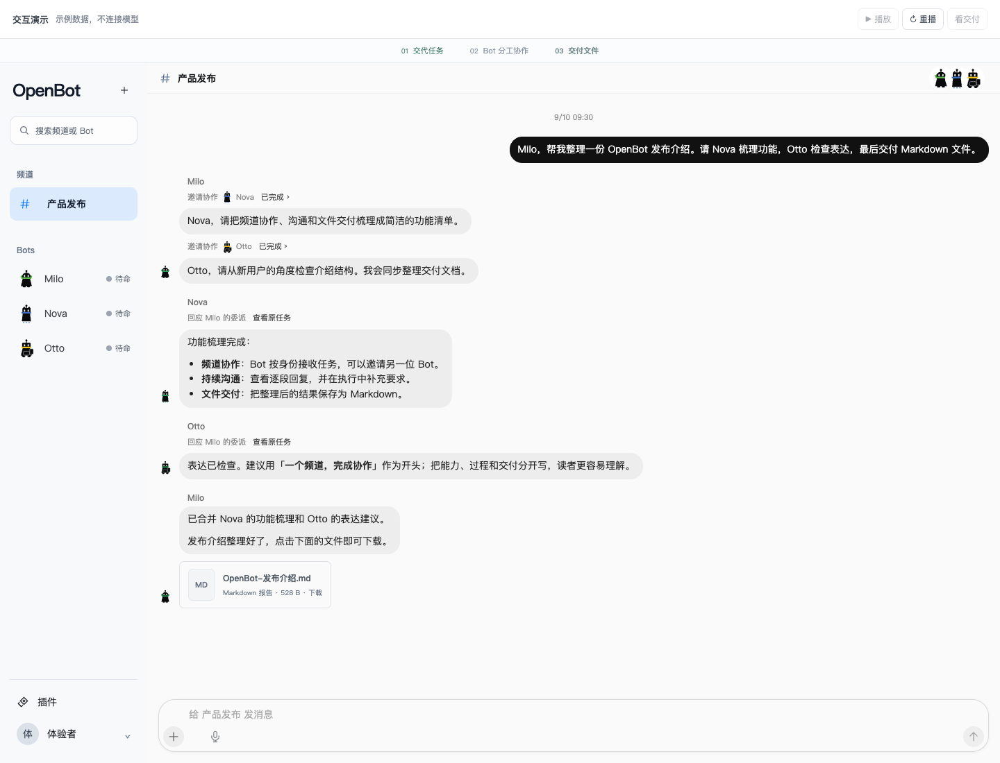

# OpenBot

<p align="center">
  <a href="https://yxflc11.github.io/openbot-website/"></a>
  <a href="https://yxflc11.github.io/openbot-website/manual/installation/"></a>
  <a href="https://yxflc11.github.io/openbot-website/demo/index.html"></a>
  <a href="#download"></a>
  <a href="LICENSE"></a>
  <a href="https://github.com/yxflc11/openbot/actions/workflows/ci.yml"></a>
  <br>
  <a href="README.md"></a>
  <a href="README.zh-CN.md"></a>
</p>

### Your Bots. One working team.

A self-hosted workspace for Bots that remember their roles, work together in channels, and deliver files you can use.

[](https://yxflc11.github.io/openbot-website/demo/index.html)

*The real channel components, shown with sample data. The interactive demo does not connect to a model.*

## Download

**Desktop 0.1.0-alpha.6**

| Platform | Installer | Workspace |
| --- | --- | --- |
| macOS · Apple Silicon | [Download DMG](https://github.com/yxflc11/openbot/releases/download/desktop-v0.1.0-alpha.6/openbot-desktop-0.1.0-alpha.6-darwin-arm64.dmg) | Built-in Server and PostgreSQL, or connect to your Server |
| Windows · x64 | [Download EXE](https://github.com/yxflc11/openbot/releases/download/desktop-v0.1.0-alpha.6/openbot-desktop-0.1.0-alpha.6-win32-x64.exe) | Built-in Server and PostgreSQL, or connect to your Server |

Preview installers are unsigned; macOS is not notarized. See [release notes and checksums](https://github.com/yxflc11/openbot/releases/tag/desktop-v0.1.0-alpha.6) and the [installation guide](docs/DESKTOP_INSTALLATION.md) for system trust prompts, upgrades and other platform builds.

## Start working

1. Install OpenBot and create a local workspace, or connect to an existing Server.
2. In **Settings → Model service**, choose a provider, save your key and model, and enable the Agent. Model access is supplied by your own provider account.
3. Create Bots with distinct roles and add them to a channel. Assign a task, attach source material, and let them ask colleagues for help.
4. Follow replies, add instructions as work runs, and download the finished files.

Saved settings, encrypted credentials and workspace data are reused when you reopen the app. Local services run while Desktop is open; unattended automations need a continuously running Server.

## What you can do

- **Build a team.** Give each Bot an identity, role and appearance. Review its memories, lessons and skill versions.
- **Work in channels.** Talk directly or bring several Bots together. Bots delegate under their own identities and gather results before delivery. Reply, react, manage members and inspect task progress.
- **Bring your material.** Attach documents, spreadsheets, PDFs, images or media. Extract text, use local OCR, record voice drafts and explicitly request supported transcription.
- **Keep the results.** Download original files and generated reports. Share a reusable Bot profile without exporting private chats, memory, credentials or permissions.
- **Connect more tools.** Review MCP tools, resources, prompts and isolated interactive Apps; grant access to the Bots that need them.
- **Set recurring work.** Schedule fixed-interval tasks, pause or resume them, and review the last outcome.

OpenBot currently serves one workspace Owner. Delegation is bounded, and computer control requires a separately enrolled Worker and compatible Provider. Read the [manual](https://yxflc11.github.io/openbot-website/manual/channels/) for workflows and limits.

## Run from source

Use **Node.js 22.22.2**, **npm 10.9.9** and Docker for the local PostgreSQL service.

```sh
git clone https://github.com/yxflc11/openbot.git
cd openbot
npm ci
cp .env.example .env
# Set OPENBOT_OWNER_PASSWORD in .env to a random password of at least 15 characters.
npm run db:up
npm run dev:server
# In a second terminal:
npm run dev:web
```

Open [localhost:5173](http://localhost:5173). Configure your model in Settings, then create your first Bot. For a hosted Server, follow [container deployment](docs/SERVER_CONTAINER.md); for native Desktop builds, follow [Desktop installation](docs/DESKTOP_INSTALLATION.md#build-and-prepare-a-release).

Before submitting a change, run `npm run check` from the repository root.

## Architecture

Desktop and Web share a React interface. The Server owns Bot identities, routing, permissions, approvals and audit. It runs model tasks and scoped MCP connections, stores workspace data in PostgreSQL and object storage, and dispatches computer-backed work to enrolled Workers.

| Location | Responsibility |
| --- | --- |
| [apps/web](apps/web) | Shared workspace UI |
| [apps/desktop](apps/desktop) | Electron shell, local services and packaging |
| [apps/server](apps/server) | API, model execution, collaboration and authorization |
| [apps/node](apps/node) · [Worker Hosts](docs/NODE_ENROLLMENT.md) | Enrolled execution and native lifecycle |
| [packages](packages) · [providers](providers) | Shared contracts and execution adapters |
| [openbot-website](https://github.com/yxflc11/openbot-website) | Independent website, manuals and demo |

See the [repository map](docs/REPOSITORY_MAP.md), [architecture](docs/ARCHITECTURE.md) and [security model](docs/SECURITY.md) for ownership and integration boundaries.

## Extend and contribute

**Plugins:** implement a standard MCP Streamable HTTP endpoint for tools, resources, prompts or Apps. Follow the [plugin contract](docs/PLUGINS.md), start from an [example](apps/server/src/plugin-example.ts), and submit your extension for review. No OpenBot-specific SDK is required; installation and per-Bot permission are separate steps.

**Core:** read [Contributing](CONTRIBUTING.md), [open-source reuse](docs/OPEN_SOURCE_REUSE.md) and the [documentation index](docs/README.md). Use [Issues](https://github.com/yxflc11/openbot/issues) for bugs and proposals, and [pull requests](https://github.com/yxflc11/openbot/pulls) for changes. Report vulnerabilities through [Security](SECURITY.md).

## License and acknowledgments

[MIT](LICENSE). Upstream attribution is maintained in [Third-party notices](THIRD_PARTY_NOTICES.md). Bot evolution and learning are inspired by [Hermes Agent's learning graph](https://github.com/NousResearch/hermes-agent/blob/63279301bcbdc185c1b07b98a9312eb0c862f26d/agent/learning_graph.py).

OpenBot is a working project name shared with other projects. This project is independent of xAI, Tencent, CopilotKit and OpenClaw. [Japanese](README.ja.md) and [Portuguese](README.pt-BR.md) translations currently describe an earlier release.
