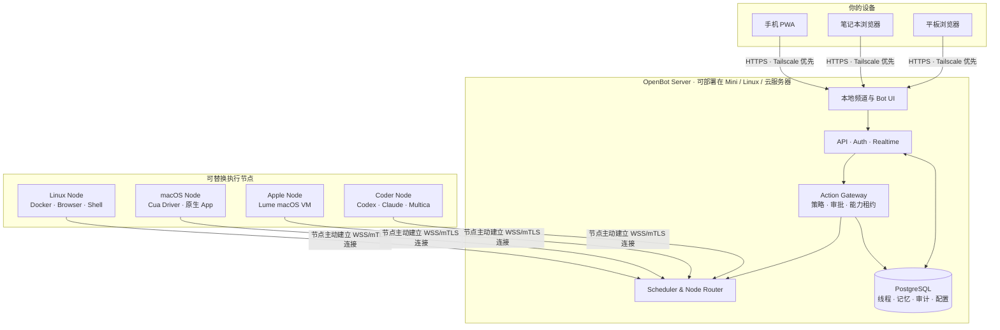
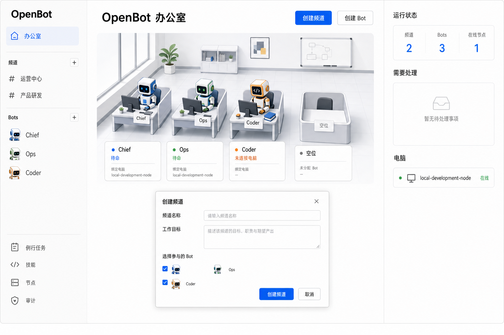
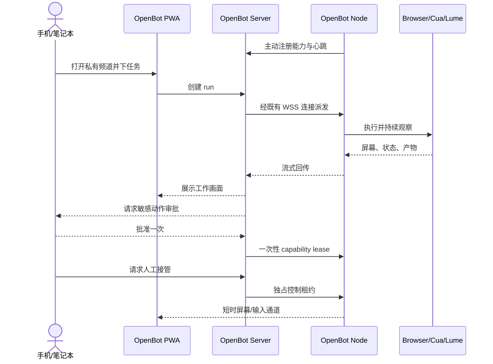

# OpenBot（暂定名）

> 融合成熟开源组件并开发关键差集，做出一个完全自托管、可从任意设备远程使用、执行节点可替换的 Grok Bot 开源复刻版。

OpenBot 自己提供频道、Bot 名册、审批、审计和远程电脑界面。手机、平板和笔记本只需打开私有 Web/PWA；Mac Mini、Linux 服务器或云主机只是可注册、可替换的执行节点。

当前状态：**M0 第四切片推进中：PostgreSQL 持久化、单 Owner 本地登录、频道/Bot 管理、Node 状态、Marvis 式办公室、本地频道消息和多设备实时同步已跑通。**

## 产品公式

```text
本地 Web/PWA 频道
  + CopilotKit/OpenBot 的产品壳、策略、审计、电脑与交接
  - CopilotKit Intelligence 云依赖
  + 本地线程/记忆/实时服务
  + 可远程注册的 OpenBot Node
  + Cua Driver / Lume / Docker 执行后端
  = 我们的自托管 Grok Bot
```

## 第一版只证明一件事

> 用户在手机浏览器打开自己的 OpenBot，对 `Ops` 说「打开测试页，填写但不要提交，截图给我」；部署在任意服务器上的控制面把任务发给在线执行节点，任务完成后在同一频道返回截图。若要求提交，系统必须停下来等批准。

## 总体架构



### 关键边界

- **Server 是系统本体**：频道、会话、Bot、策略、审批、审计和调度都在这里。
- **Node 只是员工的电脑**：上报能力、领取任务、回传屏幕和产物；不保存系统真相。
- **Mac Mini 不是必需品**：普通网页和脚本可由 Linux 服务器完成。
- **macOS 能力不能凭空替代**：若任务必须操作 Mac 原生软件，仍需一台 Mac 节点；Linux 服务器只能替代控制面和非 macOS 工作。
- **节点不开放入站管理端口**：节点主动连 Server，远程设备永远只连接 Server。

## 为什么以 CopilotKit/OpenBot 为产品底座候选

[CopilotKit/OpenBot](https://github.com/CopilotKit/OpenBot) 已经具备我们原计划大量自研的能力：Bot 名册和频道、每 Bot 容器、实时屏幕、人工接管、fail-closed CEL 策略、动作审计、凭证脱敏、routine 和结构化 Bot 交接。

我们不原样采用它，因为当前版本把持久线程和记忆绑定到 CopilotKit Intelligence，并要求项目 key 与机器 license；官方配置说明其 Intelligence 自托管不是自助功能。我们的核心开发因此变为：

1. 用本地 PostgreSQL + realtime service 替换 Intelligence。
2. 把单机 Docker supervisor 泛化成远程 Node 协议。
3. 增加 Cua Driver 与 Lume provider。
4. 把 Web UI 做成适合手机远程审批和接管的 PWA。
5. 增加 Codex、Claude、Grok CLI/AG-UI 运行适配器。

OpenClaw 降级为**可选 Agent runtime/技能来源**，不再承担频道或系统真相源，避免双控制面。

## 界面方向

默认首页参考腾讯 Marvis 的可视化办公室，让 Bot 像数字员工一样在工位上呈现状态；同时保留 Grok Bot 的长期频道和自由新增 Bot。用户可以创建频道、创建 Bot、把 Bot 加入频道，再从办公室进入任务、实时电脑、审批和产物。

Bot 角色采用原创的粗线条像素块语言：只保留方形屏幕脸、状态表情和单一角色强调色，不使用高光、复杂机械关节或拟真 3D 材质。它是系统状态图标，不应抢过任务内容的视觉层级。

这里严格区分：Bot 是员工，Node 是电脑，Channel 是工作房间，Run 是当前工作。详细交互见 [界面方案](docs/INTERFACE.md)。



## 远程控制路径



## 上游分工

| 能力 | 采用 | 我们开发什么 |
| --- | --- | --- |
| 产品壳、Bot、频道、策略、审计、容器电脑 | CopilotKit/OpenBot fork/上游基线 | 去云依赖、Node provider、PWA |
| macOS 后台操作与 VM | Cua Driver / Lume | Node adapter、审批关联、远程屏幕 |
| Agent CLI 与技能 | Codex / Claude / OpenClaw adapters | 统一 AG-UI/run contract |
| 编码任务看板 | Multica（后加） | 只给 `coder` Node |
| UX/provider 参考 | Rakazo / OpenMausBot | 不运行第二套控制面 |

## 里程碑

- **M0 — 本地控制面**：完全断开 CopilotKit Intelligence 后，频道、线程、登录和审计仍能本地运行。
- **M1 — Server + Node 闭环**：Server 向一台 Linux Node 派发浏览器任务并回传截图。
- **M2 — 远程访问与审批**：手机通过 Tailscale/PWA 使用频道、审批并安全接管。
- **M3 — macOS Node**：Cua Driver/Lume 接入，Mac Mini 成为一种节点而不是系统本体。
- **M4 — 多 Bot 与 routine**：交接、调度、重试、熔断和节点选择。
- **M5 — 发布与扩展**：一键 Server/Node 安装、签名、SBOM、升级和恢复。

详细过线标准见 [路线图](docs/ROADMAP.md)。

## 仓库结构

```text
openbot/
├── apps/
│   ├── web/                 # Web/PWA 产品壳
│   ├── server/              # 本地 API、控制面与 Node gateway
│   └── node/                # 可远程注册的执行节点 daemon
├── providers/
│   ├── docker/              # Linux 浏览器与 Shell
│   ├── cua/                 # macOS Cua Driver
│   ├── lume/                # macOS VM
│   └── coder/               # Codex / Claude / Multica
├── packages/
│   ├── config/              # 环境变量契约
│   ├── db/                  # PostgreSQL schema 与 migration
│   ├── domain/              # Channel、Bot、Run、Node 实体
│   ├── protocol/            # Server ↔ Node 与事件契约
│   ├── policy/              # fail-closed 策略
│   └── provider-sdk/        # 执行 provider 接口
├── deploy/
│   ├── server/              # Docker Compose / Linux service
│   └── node/                # macOS launchd / Linux systemd
├── examples/
└── docs/
```

## 本地启动

要求：Node.js 22+、npm 10+ 和 Docker。当前控制面使用 PostgreSQL 保存频道、Bot、成员、消息和结构化事件。

```bash
cp .env.example .env
# 编辑 .env，替换 OPENBOT_OWNER_PASSWORD 与 OPENBOT_NODE_TOKEN
npm install
npm run db:up
npm run dev
```

随后打开 `http://localhost:5173`。Server 启动时会自动执行已提交的 PostgreSQL migration；`apps/node` 会使用根目录 `.env` 中的登记令牌主动连接 Server。停止本地数据库可运行 `npm run db:stop`。提交代码前运行：

```bash
npm run check
npm audit
```

此时可通过本地 Owner 密码登录，并运行 Marvis 式办公室、Bot/频道创建、成员管理、本地频道消息、多浏览器实时同步和节点登记；任务派发、审批和远程接管仍将按 M1–M2 逐步接入。

生产环境必须使用 HTTPS，把 `OPENBOT_SECURE_COOKIES` 设为 `true`，并让 `OPENBOT_ALLOWED_ORIGINS` 只包含实际 Web/PWA 地址。Owner 密码至少 12 个字符，建议使用密码管理器生成的长随机值。

## 文档

- [产品定义](docs/PRODUCT.md)
- [系统架构](docs/ARCHITECTURE.md)
- [Marvis 办公室 + Grok Bot 频道界面方案](docs/INTERFACE.md)
- [安全模型](docs/SECURITY.md)
- [实施路线图](docs/ROADMAP.md)
- [上游选择与集成策略](docs/UPSTREAMS.md)
- [仓库拆分策略](docs/REPOSITORY.md)
- [本地 API](docs/API.md)
- [ADR-0002：本地频道与 Server/Node 架构](docs/decisions/0002-local-channel-server-node.md)
- [ADR-0003：Marvis 办公室与 Grok Bot 频道](docs/decisions/0003-marvis-office-grok-channels.md)
- [ADR-0004：基础阶段采用单一 monorepo](docs/decisions/0004-monorepo-foundation.md)
- [ADR-0005：PostgreSQL 控制面](docs/decisions/0005-postgres-control-plane.md)
- [ADR-0006：频道实时传输采用 REST + SSE](docs/decisions/0006-channel-realtime-sse.md)
- [ADR-0007：单 Owner 本地认证与数据库会话](docs/decisions/0007-local-owner-auth.md)
- [声明式配置草案](examples/openbot.example.yaml)

## 开源注意事项

`OpenBot` 已被多个公开项目使用，而且 CopilotKit/OpenBot 与本项目高度相似。当前可保留本地仓库名，但公开 fork 前必须确定独特项目名并保留所有 MIT 版权和来源说明。
