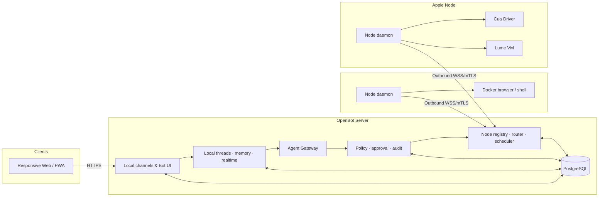

# 系统架构

## 1. 核心判断

OpenBot 必须拆成 **Server、Node、Client** 三部分：

- Server 保存系统真相并作出所有授权决定；
- Node 提供可以替换的计算机能力；
- Client 只通过 Server 查看和控制。

这使 Mac Mini 从“整套系统”变成“可选 macOS Node”。



## 2. 产品底座

以 [CopilotKit/OpenBot](https://github.com/CopilotKit/OpenBot) 作为 fork/上游基线候选，保留其：

- React/Vite 频道与 Bot UI；
- Hono server、认证和角色；
- PostgreSQL 数据模型；
- per-Bot computer、live screen 和 takeover UX；
- CEL action policy 与 fail-closed decision；
- audit、credential vault、MCP grants；
- routine worker 和结构化 Bot handoff。

必须替换或重构：

- CopilotKit Intelligence → `local-threads`；
- 单机 computer supervisor → Node Registry + provider protocol；
- 仅容器浏览器 → Docker / Cua / Lume provider；
- 桌面优先 UI → 移动端可用的 PWA；
- API-key/AG-UI Agent → 可选 Codex/Claude/Grok CLI adapter。

## 3. Server 组件

### Local Channels

频道是本项目自己的实体，不是 Telegram/飞书映射：

- 一个频道绑定一个或多个 Bot roster；
- 所有设备看到同一 thread/run/approval；
- channel membership 在 Server 校验；
- 消息、附件和组件都使用本地 object/storage contract；
- PWA 可安装到主屏幕，但仍是同一 Web 应用。

### Local Owner Auth

- M0 是单 Owner 工作区，密码由部署环境提供，Server 启动时强制要求至少 12 个字符；
- 登录成功签发随机 Session Token，浏览器只通过 `HttpOnly` Cookie 持有；
- PostgreSQL 只保存 Token 摘要、过期时间和撤销时间；
- `/api/v1` 默认拒绝匿名请求，写请求同时校验 Origin；
- 多用户、设备信任和高风险操作重新验证不混入 M0，后续在现有 Session 边界上扩展。

### Local Threads & Realtime

替代 CopilotKit Intelligence，至少提供：

- thread/message/event 持久化；
- 用户频道输入在一个短事务中同时产生 message、queued Run、`MESSAGE_CREATED` 和 `RUN_CREATED`；
- 显式 assignee 必须属于频道；未指定时由 Server 优先选择 Chief，再稳定回退到 roster 首位成员；
- Run 使用唯一 `source_message_id` 追溯来源，Client 与模型不能自行扩大频道成员边界；
- Run 在创建时固化 Bot 的 execution profile；后续只能由 Server 路由到兼容节点；
- AG-UI event stream；
- WebSocket/SSE 多设备同步；
- Bot memory 的可插拔存储；
- reconnect cursor 与幂等写入；
- 不依赖云 license 的完整启动模式。

频道消息和 Run 使用频道 SSE；在线 Node 属于整个工作区，使用独立的 Workspace SSE。Workspace 订阅建立后先发送包含在线 Node 的权威快照，再发送 `node.upserted` / `node.removed` 增量，避免连接建立期间的竞态，也避免把全局机器拓扑复制到每个频道流。

### Node Registry

记录 Node 的：

- node id、owner 和吊销状态；
- OS、架构、版本；
- capabilities 与 provider versions；
- 当前负载、健康状态和最后心跳；
- 可执行的 policy profiles；
- 屏幕/输入 transport 能力。

### Deterministic Router

路由由 Server 决定：

```text
agent policy ∩ task requirements ∩ online node capabilities
  -> exact node + provider + execution profile
```

模型可以描述任务需求，但不能选择未授权节点或扩大 profile。

当前分配流程使用两阶段握手：Server 先向候选 Node 发 `run.offer`，Node 只验证能力和本地容量并回复 accept/reject；Server 再用短数据库事务条件更新仍为 `queued` 且尚未绑定节点的 Run，成功后发送 `run.assigned` confirm。外部网络等待不占用数据库事务，条件更新保证多个调度器不能同时认领同一 Run。未完成 confirm、节点断线或 Server 重启时，尚未执行的 `assigned` Run 会回队。

执行是第二段显式握手：Node 发 `run.start_request`，Server 把仍属于该 Node 的 `assigned` Run 条件更新为 `running`，随后才发 `run.start`。Node 可上报结构化 progress，并以 completed/failed 结束；Server 先持久化结果，再发 `run.settled` 释放容量。`running` 状态失联后直接失败而不自动重试，因为 Server 无法证明外部动作尚未发生。

### Action Gateway

延续 CopilotKit/OpenBot 的“决定和审计先于执行”，再增加跨 Node 的 capability lease：

- `run_id`、agent、node、provider；
- action class 和结构化目标；
- policy id/version 与 decision；
- approval id、目标指纹、max uses、TTL；
- 执行结果、产物和 redaction。

## 4. Node 协议

Node 主动向 Server 建立长连接，避免远程机器开放管理端口。

### 控制消息

- `node.hello` / `node.heartbeat` / `node.capabilities_changed`
- `run.offer` / `run.accept` / `run.reject` / `run.assigned`
- `run.start_request` / `run.start` / `run.progress`
- `run.completed` / `run.failed` / `run.settled` / `run.cancel`
- `approval.lease` / `approval.revoke`
- `control.acquire` / `control.release`

### 数据消息

- 屏幕关键帧与增量帧；
- tool observations；
- 日志和结构化错误；
- 小产物直传；
- 大产物使用 Server 签发的短时上传 URL。

### 身份

- Node 首次使用一次性 enrollment token；
- 注册后换取独立证书/密钥；
- Server 可单独吊销一个 Node；
- Node 凭证不能登录 Web，也不能访问其他 Node；
- 所有消息绑定 connection、node、run 和 sequence。

协议 `0.3.0` 已实现 `node.hello`、heartbeat、两阶段分配、显式启动、progress、completed/failed、持久化后 settled 与 cancel。小型 PNG 截图可在 completed 消息中有界传输；Server 验证类型、编码和大小后写入 Artifact Storage。开发阶段仍使用部署级共享 `OPENBOT_NODE_TOKEN`，独立 enrollment、证书轮换、吊销和 sequence 防重放是进入不受信任网络前的硬门槛，不能把当前令牌称为完整节点身份。

## 5. Provider contract

每个 Node provider 实现同一最小接口：

```text
describe capabilities
prepare / start / stop / destroy
observe / act
execute command
list / read / write artifact
open / close human-control session
health / version
```

| Provider | 运行位置 | 用途 |
| --- | --- | --- |
| Docker | Linux/macOS Node | 隔离浏览器、Shell、文件 |
| Cua | macOS Node | 宿主机原生 App，默认观察优先 |
| Lume | Apple Silicon Node | 隔离 macOS GUI |
| Coder | 任意合格 Node | Codex/Claude/Multica 工作区 |

当前只落地了 Docker provider 的第一条 observe 能力。它是对 CopilotKit/OpenBot `agent-computer` `/navigate` 与 `/screenshot` 接口的薄适配器，而不是复制上游控制面；只有 URL 和 token 同时配置后，Node 才声明 `browser`、`screenshot`。其他 provider 目录仍是接口占位，不会虚假上报能力。

## 6. 远程屏幕与接管

Client 不直连 Node：

1. Client 向 Server 请求查看指定 run/computer。
2. Server 校验用户、频道、Bot 和 run 关系。
3. Server 创建短时 view token。
4. Node 经既有长连接或受控 WebRTC relay 回传屏幕。
5. 接管需要单独 control lease；同一电脑同时只有一个输入 owner。
6. 人接管期间 Agent action fail closed，而不是排队。

默认走 Tailscale 私网可减少公网暴露；未来公网部署仍必须 TLS、强认证、速率限制和审计。

## 7. 数据与存储

跨 Node 后不再使用 SQLite 作为系统主库，采用 PostgreSQL：

- channel/thread/message/event；
- agent/profile/grant；
- node/capability/lease；
- run/task/handoff；
- policy/decision/approval/audit；
- routine/work queue；
- credential references。

当前 PNG 截图进入 Server 本地文件存储，采用随机键、原子写入和 `0600` 文件权限；数据库只保存引用、大小、SHA-256 和 metadata。未来大产物可替换为 S3-compatible object store，而无需改变 Client 的鉴权读取接口。

## 8. 部署形态

### 单机入门

```text
一台 Linux/Mac：Server + PostgreSQL + Node + Docker
```

### 家庭常驻

```text
Linux/NAS Server：控制面 + Docker Node
Mac Mini：Cua/Lume Node
手机/笔记本：Tailscale + PWA
```

### 云控制面

```text
云服务器：Server + PostgreSQL
家中 Mac：出站连接的 macOS Node
其他服务器：按需注册 Linux/Coder Node
```

## 9. 技术栈

- 延续上游的 TypeScript、React/Vite、Hono、Bun/Node 和 PostgreSQL。
- AG-UI 作为 Agent ↔ Server 事件协议。
- 自定义版本化协议处理 Server ↔ Node。
- WebSocket 用于控制与实时状态；WebRTC/WS relay 用于屏幕。
- Cua 通过 MCP/SDK provider 接入。
- Docker Compose 负责入门部署；Linux systemd、macOS launchd 负责 Node daemon。

## 10. 上游策略

- 先做隔离 spike，不立即复制或重写全仓。
- 确认 Intelligence 替换 seam、Apple Silicon 构建和 Node provider 改造量。
- 若可行，建立正式 fork 并保留 CopilotKit MIT notice。
- 通用修复尽量回 upstream；本地化、Node 和 Cua 差集留在本项目。
- OpenClaw 只作为可选 Agent adapter，不再承担频道、线程或审批状态。
