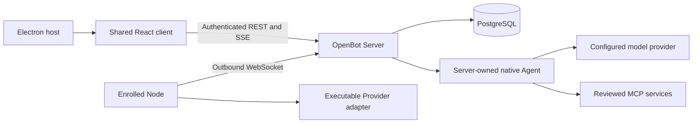

# OpenBot architecture

[简体中文](ARCHITECTURE.zh-CN.md) · [Repository map](REPOSITORY_MAP.md)

OpenBot is a TypeScript monorepo with one authoritative Server, replaceable execution Nodes and shared Desktop/Web clients. This document describes the current source tree. A directory, interface declaration or build artifact is not evidence that a platform can execute a capability.

## Runtime boundaries

| Component | Current responsibility | Authority it does not receive |
| --- | --- | --- |
| `apps/server` | Owner sessions, channel/Bot identity, membership, routing, task state, approvals, audit, native Agent execution and authorized plugin access | Models and external data cannot override Server policy |
| `apps/web` | Channel conversations, drafts, task supervision, settings and extension presentation | No direct database access, provider credentials or authorization decisions |
| `apps/desktop` | Bundled client, trusted typed bridge, connection policy, supported local Server installation and platform lifecycle | Renderer content cannot invoke arbitrary main-process operations |
| `apps/node` | Outbound enrollment/session, advertised executable capabilities, assignment lifecycle and Provider dispatch | A capability declaration does not authorize a task or side effect |
| `providers/*` | Narrow integration with a specific execution backend | No ownership of Bot identity, channel membership, approval or final task truth |
| `packages/domain`, `packages/protocol`, `packages/db` | Product types, validated wire contracts, schema and ordered migrations | A TypeScript type alone is not a runtime authorization check |

## Data and state

PostgreSQL stores Bots, channel membership, messages, Runs, task ancestry, approvals, audit, memory and skills. One submitted channel message may have up to six exact recipients and one Run per recipient. `(source_message_id, bot_id)` prevents duplicate per-Bot tasks while preserving one human source message. The Server validates all recipients before committing the submission.

Task transitions use conditional updates and transactions. Native claims and collaboration use explicit advisory/row locks. Member removal cancels affected active task trees and expires pending approvals before membership disappears; direct conversations keep a fixed Bot. Reactions represent the single Owner's own selections, not synthetic multi-user activity.

Large binary content is stored outside the database behind Server-owned metadata and authenticated access. Channel attachments, generated artifacts and transient runtime frames have separate APIs and limits. A message mentioning an attachment ID does not by itself grant access.

## Native Agent and collaboration

For an opted-in Bot with execution profile `none`, the Server runs the installed AI SDK `ToolLoopAgent` against the configured model adapter. Every tool is bound to the claimed Run's Bot and channel. Profile text, memory, skills, messages, webpages, plugin descriptions and colleague results are untrusted guidance; none can grant authority.

Up to six root tasks can execute concurrently, with root tasks for the same Bot/channel serialized. `start_task` returns a nonblocking child receipt; `wait_for_task` joins an exact child; `delegate_task` combines both. Child tasks use their own identity and grants. Two delegation levels, four descendants, per-Run step/tool budgets and a shared root deadline bound collaboration. Unread colleague results are joined before a parent final answer commits.

Explicit Owner steering is stored against one queued/running native Run and injected at the next model step. It cannot alter completed effects or silently change another task. The completion transaction detects accepted but unapplied corrections and requires another bounded continuation.

Supported provider streaming produces transient public text drafts over `run.output`. Final replies, artifact metadata and terminal task state commit together. Drafts are not audit truth, private reasoning is never displayed, and MiniMax retains the guarded nonstreaming path. Interrupted tasks fail on Server restart; ambiguous external effects are not replayed automatically. See [native Agent](NATIVE_AGENT.md) and [asynchronous collaboration](ASYNC_COLLABORATION.md).

## Nodes, Providers and approvals

Worker-backed tasks follow the existing Server/Node assignment protocol. Nodes connect outward, advertise actual executable capabilities and capacity, and accept only Server-issued assignments. Offer/accept/confirm, start, progress, frames, terminal result and settlement messages have validated contracts. The Server reconciles disconnects and can send a cancellation after durable revocation.

The Docker integration is a thin adapter to reviewed upstream computer endpoints for explicitly supported operations; it does not copy an upstream control plane. Other Provider declarations are not execution support. Consult [Provider conformance](PROVIDER_CONFORMANCE.md), [cross-platform boundaries](CROSS_PLATFORM.md) and the relevant Worker Host documentation before making support claims.

Approval-requiring effects must be recorded and approved through the Server's policy path before dispatch. Removing a member or ending a Run invalidates future authorization; a late provider result cannot overwrite a terminal Server state.

## Plugins and external integration

MCP is the extension transport for reviewed tools, resources and Owner-selected prompts. Installation pins a reviewed manifest; each Bot has explicit grants. Confirm-mode tools require a fresh decision for exact arguments. Plugin app content runs in a restricted presentation surface and does not gain general Desktop or Server access. See [plugin protocol and author guide](PLUGINS.md).

OpenBot's internal Node protocol and channel REST/SSE contracts remain distinct from MCP. The current implementation is not an AG-UI or Matrix federation implementation. Standard protocols are reused where they fit the boundary; local identity and audit remain owned by the Server. [Open-source reuse](OPEN_SOURCE_REUSE.md) records exact upstreams, licenses and incorporation decisions. Employee learning inspiration from Hermes Agent remains attributed there.

## Clients, synchronization and installation

Desktop packages the React client and uses a typed, restricted Electron bridge. Web connects through authenticated Server REST/SSE. Channel SSE carries messages, task states, progress, transient output and interactions; workspace SSE carries broader workspace changes. Reconnect reloads authoritative snapshots. There is no claim of a durable replay cursor for every transient event.

Local Server packaging, data permissions and lifecycle are platform-specific. The current work adds Windows x64 adaptation while preserving existing macOS behavior; a successful build is distinct from installed lifecycle evidence. Linux and other architectures retain their explicitly documented status. See [Windows Desktop](WINDOWS_DESKTOP.md) and [Desktop installation](DESKTOP_INSTALLATION.md). The office visualization remains an optional deferred plugin.

## Engineering entry points

`npm run check` runs repository policy/documentation checks, migration checks, lint, strict type checking, tests and builds. Dedicated PostgreSQL CI steps run transaction suites against separate disposable databases. Model/transport mocks, real database tests, rendered client acceptance and real-platform execution provide different evidence and must not be conflated.

Start from the [repository map](REPOSITORY_MAP.md) and [contributor guide](../CONTRIBUTING.md). The [audit](REPOSITORY_AUDIT.md) tracks remaining maintainability issues without presenting planned refactors as completed work.
