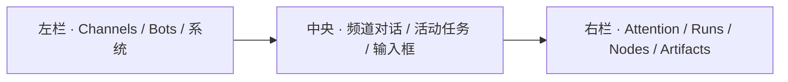
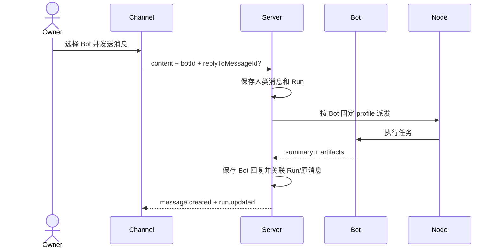

# 界面方案：频道优先 + 可选办公室插件

## 1. 当前结论

当前版本以 **长期频道中的多 Bot 对话**为核心。腾讯 Marvis 只作为未来空间化总览的参考，办公室不出现在当前桌面侧栏、移动端导航或默认 Web bundle 中。

产品公式：

> **Grok Bot 式频道与自由新增 Bot + OpenBot 的本地数据、远程 Node、审批和接管 + 可选 Marvis 式办公室插件。**

## 2. 四个对象

| 对象 | 含义 | 当前界面 |
| --- | --- | --- |
| Channel | 一段长期工作上下文 | 主工作区与消息时间线 |
| Bot | 有名字、职责、外观、权限和固定执行配置的数字员工 | 名册、频道成员、消息作者 |
| Run | 一次具体任务 | 频道活动条、Inspector、审批和结果 |
| Node | 可替换的真实执行机器 | 右栏状态与 Run 详情 |

Bot 是员工，Node 是电脑，Channel 是协作空间，Run 是一次工作。

## 3. 当前桌面结构

- 启动后自动进入第一个频道，不经过首页或办公室。
- 没有频道时只显示创建频道的最短引导。
- 频道标题显示 Bot 成员、实时连接状态和添加 Bot 操作。
- 消息时间线是最大区域，任务队列只保留为紧凑的活动条。
- 右栏继续承担跨频道的审批、节点和结果总览。

## 4. 频道对话

消息能力：

- 人可以从频道成员中明确选择接收任务的 Bot；
- 每条任务消息与 Run 关联；
- Run 完成后结果以执行 Bot 的身份保存，而不是只留在临时任务卡；
- Bot 回复可以引用原消息，并展示段落、加粗、列表、Markdown 表格和截图产物；
- “回复”会把目标消息带入下一条任务；“任务详情”打开对应 Inspector；
- 输入框固定在底部，Enter 发送、Shift+Enter 换行。

当前结构已能表达 Bot 与人的连续对话，也为后续 Bot-to-Bot 交接保留了作者、回复目标和 Run 关联。自动触发第二个 Bot 仍应由结构化 handoff 协议完成，不通过解析自然语言 `@mention` 猜测。

## 5. 组合式 Bot 身份

用户提供的机器人设定被抽象成五个可组合层：

| 层 | 当前选项 |
| --- | --- |
| Head | 圆角、方形、猫耳 |
| Body | 基础、长身、披风、装甲、收纳、四足 |
| Mobility | 双脚、单轮、双轮、悬浮、四足 |
| Accessory | 无、耳机、背包、斗篷、机械臂、工具箱 |
| Accent | 绿、黄、红、蓝 |

创建 Bot 时可以实时组合预览。Appearance 随 Bot 存入本地配置；状态只临时覆盖强调色或透明度，不改变身份本身。当前不引入 NFT 稀有度、交易或链上依赖，但数据模型允许以后导出组合编码。

## 6. 移动端

底部导航只有三项：

1. `Channels`
2. `Bots`
3. `Approvals`

频道保持单栏对话，活动任务横向滚动，回复操作始终可见，输入框贴近底部导航。没有没有实现的麦克风、表情或附件按钮；新增控制只有具备真实行为时才显示。

## 7. 办公室插件边界

`@openbot/office-plugin` 是独立 workspace 包：

- `apps/web` 不依赖它，因此当前版本不展示也不加载办公室；
- 插件接收 Bot、Channel、Run、Node 和 Avatar renderer；
- 插件可以打开频道或 Run，但不能自己修改任务状态；
- 插件样式独立导出，后续可单独做 1–2 轮视觉优化；
- 是否启用将由未来的显式插件注册与 feature flag 决定。

## 8. 当前 V1 体验

1. 创建组合式 `Ops` Bot；
2. 创建频道并加入 `Ops`；
3. 在频道输入框选择 `Ops` 并下达任务；
4. 活动条显示执行进度，Inspector 显示电脑、进度与审批；
5. 敏感动作停下等待 Owner；
6. 完成后 `Ops` 在频道中回复结果、表格和截图；
7. 手机或另一台电脑看到相同消息和状态。

办公室、社交化技能广场、自由画布、Bot 交易和复杂装饰均不进入当前版本。
