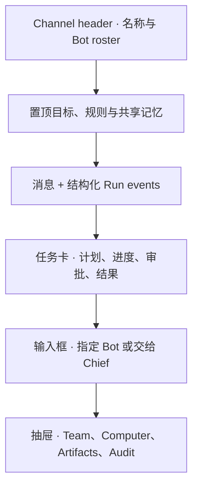
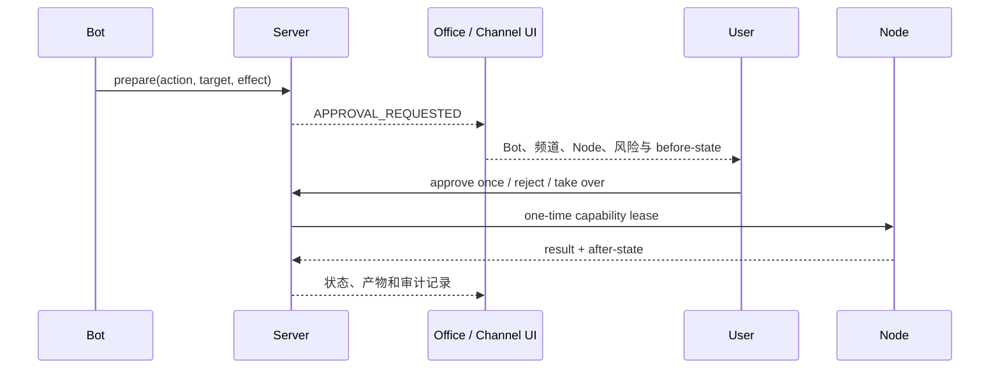

# 界面方案：Marvis 办公室 + Grok Bot 频道

## 1. 设计结论

OpenBot 的主界面以 **腾讯 Marvis 的可视化办公室**为核心，而不是以普通聊天窗口或工程看板为核心；同时保留 Grok Bot 最重要的两个产品能力：

1. 用户可以创建多个长期频道；
2. 用户可以随时创建 Bot，并把不同 Bot 加入频道。

最终产品公式：

> **Marvis 的办公室总览 + Grok Bot 的频道与 Bot 名册 + OpenBot 的远程电脑、审批和可替换 Node。**

设计研究参考：

- [腾讯 Marvis](https://marvis.qq.com/)
- [腾讯云：Marvis 产品与多 Agent 架构](https://developer.cloud.tencent.com/techpedia/2612)
- [CopilotKit/OpenBot](https://github.com/CopilotKit/OpenBot)

这些产品只作为能力和交互参考；项目不复制或分发其商标、角色形象与品牌素材。

## 2. 四个不能混淆的对象

| 对象 | 含义 | 界面表现 |
| --- | --- | --- |
| Channel | 一段长期工作上下文，包含成员、消息、任务和产物 | 左栏频道；可新建、归档和配置 Bot roster |
| Bot | 有名字、角色、模型、技能和权限的数字员工 | 办公室中的角色；可创建并加入多个频道 |
| Run | 一次有开始、过程和结果的具体任务 | Bot 手上的工作卡、右栏进度与频道事件 |
| Node | 真正执行浏览器、Shell 或 macOS 操作的机器 | 工位上的电脑及状态；可以被替换 |

因此：**Bot 是员工，Node 是电脑，Channel 是工作房间，Run 是当前工作。**

## 3. 桌面信息架构

```mermaid
flowchart LR
    subgraph L["左栏 · 导航与频道"]
      L1["Office"]
      L2["Channels +"]
      L3["Bots +"]
      L4["Routines · Skills"]
      L5["Nodes · Audit"]
    end

    subgraph C["中央 · Marvis 式办公室"]
      C1["Bot 角色与工位"]
      C2["运行 / 等待 / 阻塞 / 离线"]
      C3["当前 Run 与 Channel"]
      C4["点击进入 Bot 或任务"]
    end

    subgraph R["右栏 · Context Panel"]
      R1["Attention · 审批"]
      R2["Active runs"]
      R3["实时电脑"]
      R4["Artifacts"]
      R5["Token / Cost"]
    end

    L --> C --> R
```

### 左栏

- `Office` 是默认首页。
- `Channels` 标题旁固定 `+`，下方列出频道和未读/运行状态。
- `Bots` 标题旁固定 `+`，下方列出用户创建的 Bot。
- `Routines`、`Skills`、`Nodes` 和 `Audit` 是系统级入口，不塞进任何单个频道。
- 频道和 Bot 必须分组显示，避免把“在哪里协作”和“谁来工作”混为一谈。

### 中央办公室

- 每个 Bot 有固定角色形象、名字、职责和状态文字。角色使用 32×32 网格的三色 SVG 像素块语言，在 28px 头像和办公室大图中保持同一轮廓。
- 角色只保留方形屏幕脸与单一强调色，不使用拟真高光、复杂关节、手指和装甲分件；角色服务于状态识别，不能抢占任务信息。
- 工位上的电脑代表当前绑定 Node；没有 Node 时显示“无可用电脑”，而不是空白屏幕。
- Bot 工作时显示任务简称、所属频道和进度；等待审批时必须使用显眼的文字与图标。
- 点击 Bot 打开 Bot 面板；点击任务打开 Channel 中对应的 Run。
- 办公室负责回答“谁在做什么”，不承担完整日志和复杂配置。

### 右栏

右栏按紧急程度排列：

1. **Attention**：审批、阻塞和需要补充的信息；有内容时始终置顶。
2. **Active runs**：运行中、等待和最近完成的任务。
3. **Computer**：当前 Node、能力、实时缩略画面和查看/暂停/接管。
4. **Artifacts**：截图、文件、报告和 diff。
5. **Usage**：Token、模型费用和本地模型节省；不能抢占任务信息的视觉层级。

## 4. 频道体验

频道继承 Grok Bot 的长期协作方式，但使用 OpenBot 自己的本地数据模型。

每个频道拥有：

- 名称、说明、成员和默认 Chief；
- 独立线程、共享记忆、文件和 routine；
- Bot roster；同一个 Bot 可以加入多个频道，但每次 Run 的上下文必须隔离；
- `@Bot` 指派，以及“不指定时交给 Chief”的默认路由；
- 频道级审批策略只能收紧 Bot 权限，不能扩大 Bot 的全局能力。

频道不是多人角色扮演群聊。Bot 间交接使用结构化任务卡，消息流只展示用户需要理解的摘要。

## 5. 创建频道

`+ Channel` 使用四步轻量流程：

1. 填写频道名称和工作目标；
2. 选择一个 Chief，可选择其他 Bot；
3. 选择允许使用的文件、凭证和 Node 范围；
4. 预览安全边界并创建。

默认创建一个只有用户和 Chief 的私有频道。之后可从频道标题栏添加或移除 Bot。

## 6. 创建 Bot

`+ Bot` 创建的是持久数字员工，而不是临时 Prompt：

| 配置 | 内容 |
| --- | --- |
| Identity | 名字、头像、职责和简介 |
| Brain | 模型、系统指令和记忆范围 |
| Skills | Skills、MCP、工具和 Agent adapter |
| Computer | `none`、`docker-linux`、`macos-cua`、`lume-vm` 或 `coder` |
| Policy | 自动、需批和禁止动作 |
| Channels | 创建后默认加入哪些频道 |

创建完成后 Bot 先进入“未上岗”状态，用户明确加入频道后才接收任务。

## 7. 关键状态

| 状态 | 办公室表现 | 允许的用户动作 |
| --- | --- | --- |
| Idle | 在工位等待，显示最近完成时间 | 下任务、配置 |
| Running | 活动标记、任务名、频道和进度 | 查看、补充要求、暂停 |
| Waiting approval | 琥珀色警告和具体待批动作 | 批准一次、拒绝、接管 |
| Blocked | 阻塞原因和需要的信息 | 回复、重试、改派 |
| Human takeover | 明确显示“用户正在控制” | 输入、释放控制 |
| Offline | Bot 保留，Node 显示离线 | 换 Node、等待 |
| Completed | 短时完成反馈，随后回到 Idle | 查看结果、复用 routine |
| Failed | 失败原因和最后 checkpoint | 重试、改派、查看审计 |

状态不能只靠角色动画或颜色表达，必须同时提供文字、图标和可访问标签。

## 8. 审批与人工接管

审批在三个位置同步出现：办公室中的 Bot、右侧 Attention、所属频道的 Run 卡。批准按钮使用具体动作名称，例如“发送这封邮件”，不能只写“继续”。

## 9. 移动端

手机 PWA 不渲染完整办公室平面，而是使用纵向员工卡：

- 首页显示在线 Bot、活跃任务和待审批数量；
- `Channels`、`Bots`、`Approvals`、`Office` 使用底部导航；
- 频道保持单栏消息与任务卡；Team、Computer、Artifacts 进入底部抽屉；
- 电脑观察和接管进入全屏模式，并取得独占 control lease；
- 手机可以创建频道和把现有 Bot 加入频道；复杂 Bot 配置建议在桌面完成。

## 10. 事件驱动

办公室、频道和移动端由同一份 Server 事件投影，不解析聊天文本猜状态：

频道级 SSE 已投影 `MESSAGE_CREATED`、`RUN_CREATED`、`RUN_ASSIGNED`、`RUN_STARTED`、`RUN_PROGRESS`、`RUN_COMPLETED`、`RUN_FAILED` 与 `RUN_REQUEUED`，全局 Workspace SSE 投影 Node 上线、心跳容量和断开，REST 继续承担写命令。Web 按实体 ID、时间和状态版本合并历史快照与实时事件，把同一任务同步到频道任务卡、Bot 工位、右栏与 Inspector，并避免较旧的 REST 响应覆盖较新的 SSE 状态。Inspector 已显示任务原文、执行 Bot、Node、进度时间线、结果和 PNG Artifact；实时电脑画面和审批仍待接入。

| 事件 | UI 投影 |
| --- | --- |
| `CHANNEL_CREATED` | 左栏频道 |
| `BOT_CREATED` | Bot 列表和办公室角色 |
| `BOT_JOINED_CHANNEL` | Channel roster |
| `MESSAGE_CREATED` | 频道本地消息流 |
| `RUN_CREATED` | Bot 当前工作和频道任务卡 |
| `RUN_ASSIGNED` | 已分配状态、Bot 工位绑定 Node、节点槽位占用 |
| `RUN_REQUEUED` | 回到等待节点并释放原节点槽位 |
| `RUN_STARTED` | 运行中状态与 Node 占用 |
| `RUN_PROGRESS` | 结构化执行轨迹；实时进入任务卡和 Inspector 时间线 |
| `RUN_FAILED` | 明确错误与终止反馈 |
| `RUN_PLAN_UPDATED` | 进度 |
| `NODE_BOUND` | 工位电脑状态 |
| `APPROVAL_REQUESTED` | Bot 警告、Attention 与频道审批卡 |
| `FRAME_UPDATED` | Computer 预览 |
| `ARTIFACT_CREATED` | Artifacts |
| `RUN_BLOCKED` | 阻塞状态 |
| `RUN_COMPLETED` | 完成反馈和结果 |

## 11. V1 界面范围

第一版只证明一条完整体验：

1. 用户创建 `Ops` Bot；
2. 创建一个频道并把 `Ops` 加入；
3. 在办公室看到 `Ops` 接单并绑定 Linux Node；
4. 进入频道查看任务、电脑画面和进度；
5. 提交动作同时在办公室、右栏和频道出现审批；
6. 完成后截图进入 Artifacts，Bot 回到 Idle。

复杂办公室装修、自定义角色动画、自由编排画布、社交化技能广场和运营仪表盘不进入 V1。
